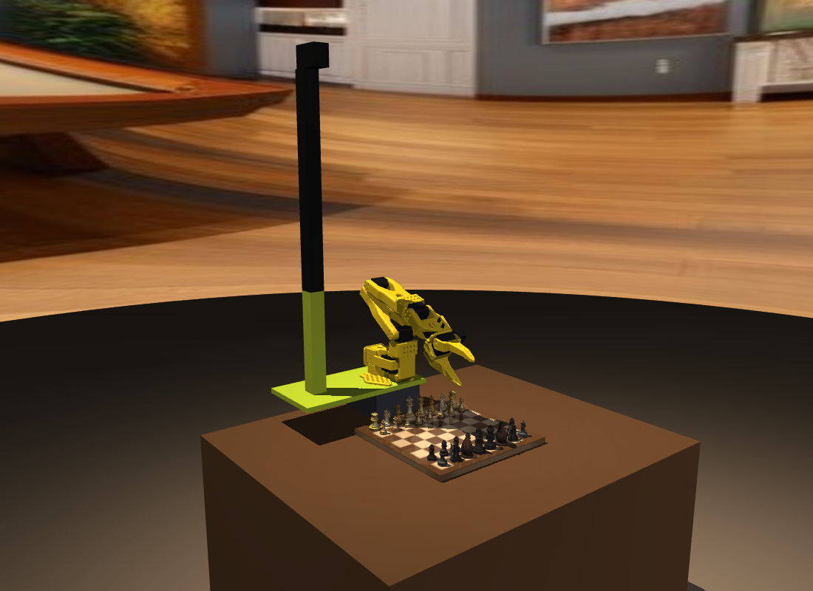
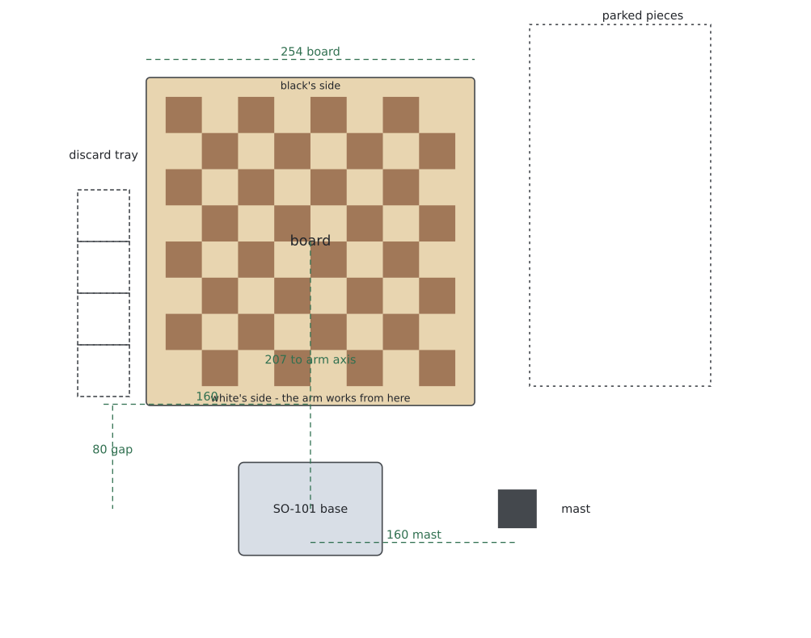
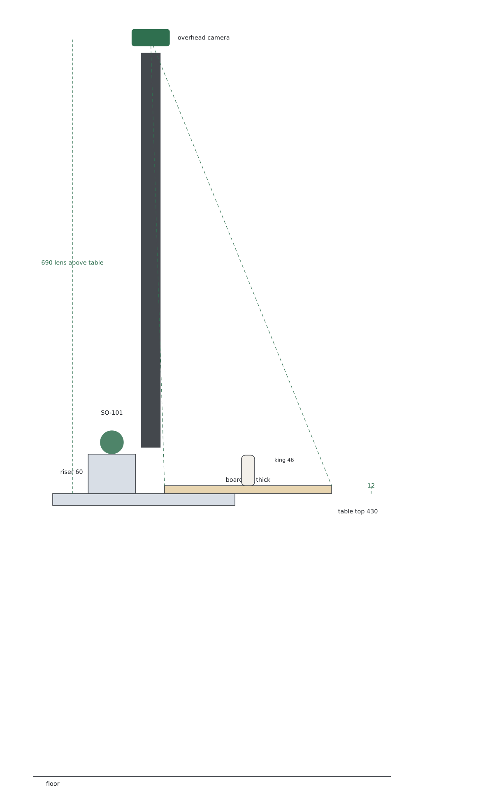
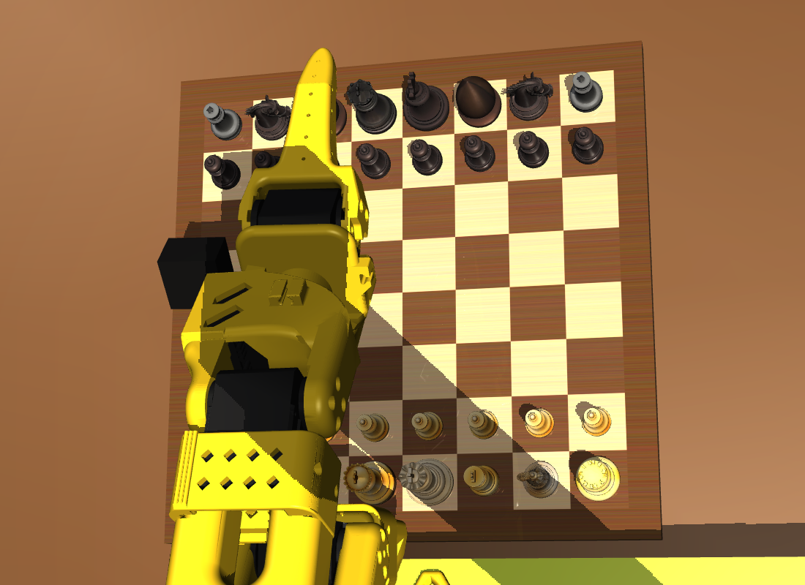

# Building the rig

Everything the policy sees, as a physical bench: a mini board, an SO-101 on a
riser, a camera looking down from a mast, and a tray for captured pieces.



Every dimension below is generated from `chess_sim` by `hardware/generate.py`
and stored in `hardware/dimensions.json`, so what you build matches the scene
the policy trained in.

**These are simulated dimensions.** The scene was tuned until the arm could work
a chess position reliably; nothing here has been built or measured on a physical
bench yet, and the sim-to-real gap is unmeasured. It is a buildable
specification, not a product.

## The layout

Looking down at the table. The arm works from white's side; the mast stands to
its right, the discard tray to its left, and pieces the position does not use
park off the right-hand edge.



Looking along the table: the riser is what makes the near ranks reachable, and
the dashed lines are what the overhead camera has to take in.



## Buy

| item | what it has to be |
| --- | --- |
| SO-101 follower arm | the standard build from [SO-ARM100](https://github.com/TheRobotStudio/SO-ARM100) - BOM and print files there; its meshes are vendored here under `chess_sim/assets/so101/` |
| overhead camera | ≥ 21.2° vertical field of view at 678 mm, so the whole 254 mm board fits; the sim renders 24° |
| wrist camera | wide angle, ~75°, small enough to sit beside the wrist-roll motor |
| table | flat, 430 mm to the top (or set your own `BoardConfig.table_top` and re-generate) |
| chess set | 28 mm squares, king no taller than 46 mm - a travel set, or print the board below |
| board substrate | 254 × 254 mm, 12 mm ply or MDF |
| fasteners | M3 for the arm plate, the mast and the camera mounts |

## Print

`hardware/stl/` holds four parts as solid blocks, sized from the scene:

| file | what it is | mm |
| --- | --- | --- |
| `arm_riser.stl` | pedestal under the arm base | 111 × 72 × 60 |
| `mast_plate.stl` | plate carrying both arm and mast | 280 × 140 × 10 |
| `mast_tube.stl` | one half of the mast (print two) | 30 × 30 × 300 |
| `capture_tray.stl` | four pockets for captured pieces | 46 × 166 × 15 |

`hardware/parts.scad` is the same set parametrically - hollow tube, real tray
pockets, one variable per dimension - for anyone adjusting wall thickness,
splitting the mast differently, or fitting their own camera mount. Both are
generated; edit `hardware/generate.py`, not the outputs.

## The board and the pieces

| | mm |
| --- | --- |
| square | 28.0 |
| playing field | 224.0 |
| border | 15.0 per side |
| board overall | 254.0 × 254.0 |
| board thickness | 12.0 |

`hardware/board_254mm.png` is the board artwork at 300 dpi - print at 100%
scale (254 mm across, borders included) and mount it on the substrate.

| piece | per side | height | widest ⌀ | grasp ⌀ | grasp height |
| --- | --- | --- | --- | --- | --- |
| pawn | 8 | 27.2 | 13.1 | 8.3 | 22.4 |
| rook | 2 | 30.4 | 21.9 | 12.0 | 10.6 |
| knight | 2 | 33.6 | 18.2 | 17.6 | 18.5 |
| bishop | 2 | 36.8 | 13.4 | 12.1 | 20.2 |
| queen | 1 | 41.6 | 22.1 | 12.7 | 34.3 |
| king | 1 | 46.4 | 17.3 | 12.6 | 38.3 |

Grasp diameter is where the jaws close and grasp height is how far up the piece
that is: match those two within a couple of millimetres and the trained grasp
has a chance of transferring. The widest diameter is a clearance limit - nothing
may exceed the 28 mm pitch, or neighbouring pieces block the jaw.

## Where things stand

| | mm from the board centre |
| --- | --- |
| arm base | (0, −207), on a 60 mm riser |
| arm base footprint | 111 × 72 |
| board edge to arm base | 80 |
| mast axis | 160 to the arm's right |
| discard tray, first slot | (−160, −100), then 4 slots at 40 pitch |

## The cameras

The overhead camera sits on the mast 690 mm above the table, 678 above the board
surface, looking straight down. It needs at least 21.2° of vertical field of
view to see the whole board; the simulated one uses 24°, which puts a 288 mm
strip in frame. This is what it sees:



The wrist camera sits at (−75, +45, +12) mm in the gripper's tool frame - beside
the wrist-roll motor, pointing at the fingertips - with about 75° of field of
view. Both record at 640 × 480. Those two views are the entire observation the
policy gets, so where they point matters more than how many pixels they have.

## Assembly order

1. Print the parts and mount the arm on the riser, riser on the plate.
2. Bolt the mast to the plate, 160 mm to the arm's right; camera on top, aimed
   down at the board centre.
3. Set the plate on the table so the board's near edge is 80 mm from the arm
   base - 207 mm from the arm axis to the board centre.
4. Mount the board artwork on the substrate and place it on that mark.
5. Put the tray 160 mm to the arm's left.
6. Check the overhead frame: the whole board, upright along the files, white at
   the bottom. That framing is what the policy was trained on.

## Regenerating

```bash
MUJOCO_GL=egl python hardware/generate.py              # everything, renders included
MUJOCO_GL=egl python hardware/generate.py --no-render  # drawings and STLs only
```

Change a dimension in `chess_sim/config.py` - a different square size, a taller
table - and re-run it; the drawings, the STLs, `parts.scad`, the artwork and the
build sheet all follow.
